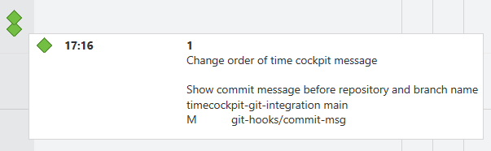

# timecockpit-git-integration
Integrates git commits into the time tracking software 'time cockpit'.

This is achieved by utilizing
- Time cockpit's [file signal tracker](https://help.timecockpit.com/doc/signal-tracker/import-signals.html)
- Global git hooks

The following image shows how a multi-line commit will appear in time cockpit's day view.



The first line is a deprecated number (*1*) still required by time cockpit but has no meaning; therefore, it can be ignored. The next three lines show the commit message, followed by the repository and the branch name *timecockpit-git-integration main*. The last part are all changed files (here only *git-hooks/msg-commit*) with their modification state (*M*).

## Installation
- `git clone https://github.com/dzoech/timecockpit-git-integration.git`
- `cd ./timecockpit-git-integration`
- `git config --global core.hooksPath $pwd/git-hooks`
- Open time cockpit desktop client and select *Signal Tracker* in the bottom left
- Start the signal tracker *Import from external signal sources* and configure it as below and hit *Apply Changes*

```
Polling Interval: 00:01:00 (or as you prefer)
Path to CSV Files: C:\Users\dominik.zoechbauer\git-repos\timecockpit-git-integration\git-hooks\logs (path to the cloned git repository)
Entity: ChangeSetSignal (time cockpit internal configuration)
```


## Hints
- Commit notes only appear in time cockpit's *Day* view
- It might take some time until a commit note appears in time cockpit